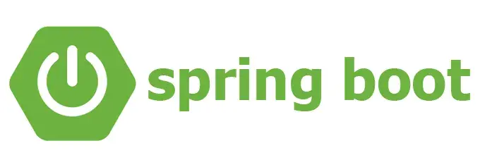

SpringBoot(스프링부트)는 Java(자바)라는 언어로 만들어진 Web Application Framework(웹 어플리케이션 프레임워크)인 spring framework(스프링 프레임워크)를 좀더 쉽게 사용할 수 있도록 것이다. 이전의 Spring framwork(스프링 프레임워크)는 xml을 이용하여 설정등이 굉장이 까다롭고 가독성이 좋지 않았다. SpringBoot(스프링부트)가 나오면서 어노테이션을 이용하여 설정들이 간편해지고 러닝커브가 낮아졌다. 

## 왜 사용하는가?

자바스크립트, 파이썬, 루비, 고랭등 많은 언어로 만들어진 웹 서비스들도 많이 있지만 좀더 안정적인 웹 서비스를 만들고 싶다면 스프링 부트를 쓰는것이 좋다고 생각한다. 국내에 대형 서비스들은 대부분 스프링을 사용하여 시스템을 운영하고 있다. 

그리고 오래전부터 많은 사람들이 사용하여 굉장히 많은 정보와 사례들이 존재하여 운영에 도움이 많이 된다.

스프링 부트는 WAS를 내장시켜 설정이 간편하게 웹서비스를 구축할 수 있으며 각종 설정등을 간편하게 할 수 있다. 이로 인하여 동일한 설정과 조건으로 배포가 가능하다. 

다른 프로젝트들 처럼 빌드/패키징을 통해 배포하지 않고, jar/war라는 파일을 만들어 배포함으로써 배포가 간단하다.

라이브러리가 많고, 라이브러리 버전 관리가 용이하며 프로젝트 설정이 간단하다.

## 개발툴은?

대표적인 개발툴로는 이클립스와 인텔리제이가 있다. 둘중 어느 것을 사용하여 개발을 한다고 해도 상관은 없다.

### 이클립스

이클립스는 역사도 깊고 플러그인도 많다. 그리고 커스텀도 쉽게 된다. 그리고 무료다. 무료라는 장점은 굉장히 크다. 또한 여러가지 프로젝트를 한번에 관리할 수도 있다. 하지만 오픈소스라 버그가 많고 가끔 버전이 올라가서 하위 호환성에 문제가 생기기도 한다. 그래도 별 문제는 없다.

### 인텔리제이

인텔리제이는 일단 이클립스보다 좋다. 모든 면에서 훌륭하다. 이클립스에서는 볼 수 없는 강력한 기능들이 있어서 한번 인텔리제이를 쓰면 이클립스로 돌아가는게 너무 힘들다. (개인적인 생각이다.) 자동완성, 소스 리팩토링… 모두 훌륭하다. github이랑 연동이 기가 막히게 된다. 근데 왜 이클립스를 쓰냐? 인텔리제이는 유료다…. 무료도 있지만… 유료다…

### 인텔리제이 무료 vs 유료

무료라고 개발을 못하는게 아니다. 자잘 자잘한 기능들이 유료를 사게 만든다… 그냥 조금만 불편하면 무료를 써도 되지만 그 불편이 곧 유료를 구매하도록 만들 것이다. ㅋㅋㅋㅋㅋㅋ

```toc
```