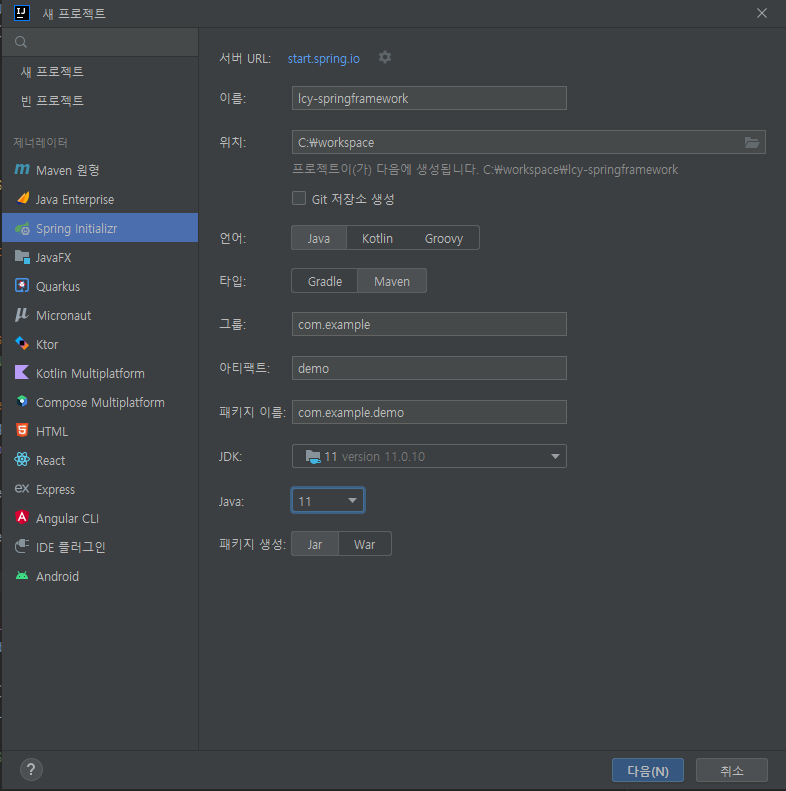
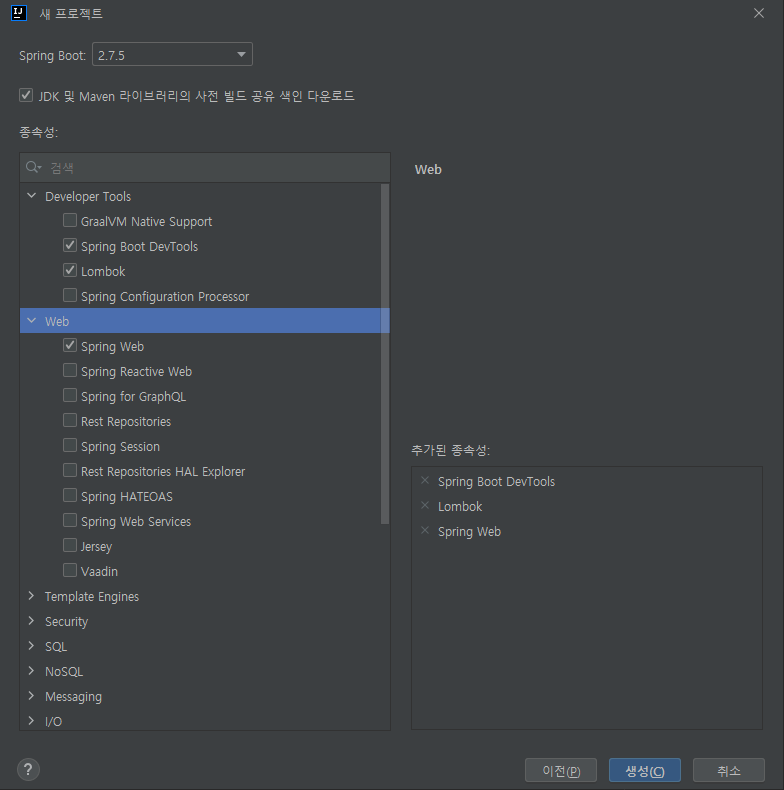
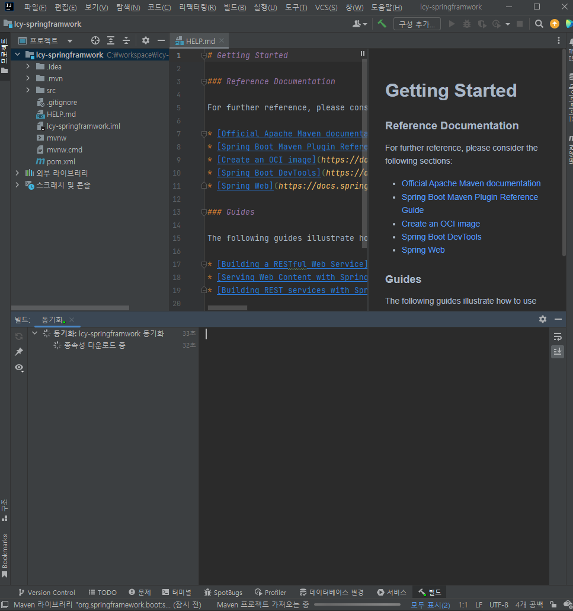

## 프로젝트 생성

인텔리제이 유료버전을 기반으로 작성한다.

인텔리제이 [파일 - 새로만들기 - 새 프로젝트]를 눌러서 새창이 뜬다.



- 이름(Name) : 프로젝트 이름
- 위치(Location) : 프로젝트 저장 위치
- 언어(Language) : 사용할 언어
- 타입(Type) : 라이브러리 의존성을 위한 도구를 설정
- 그룹(Group) : 패키지 이름의 앞쪽에 위치한 프리픽스. 보통 도메인을 거꾸로 사용.
- 아티펙트(Artifact) : 프로젝트 결과물의 이름이라고 볼 수 있다.
- 패키지이름(Package name) : 그룹 + 아티팩트를 기본으로 만들어지며 수정이 가능하다.
- JDK(Project SDK) : 사용할 SDK의 버전
- Java : 사용할 자바의 버전
- 패키지 생성(Packaging) : 패키징 될 파일형태를 지정

다음~



- Spring Boot : 스프링부트의 버전
- 종속성(Dependencies) : 사용할 라이브러리를 추가

Lombok은 getter/setter를 만들지 않고 어노테이션 하나로 처리해주는 라이브러리다. Lombok이 사용이 안될때는 Lombok.jar를 실행하여 설치하여 IDE를 재시작 후 사용하면 된다. 구글에 물어보셈.



각종 필요한 셋팅을 하고 프로젝트 생성이 완료된다. 

mvnw 라는 파일과 .mvn폴더가 존재한다. 해당 파일들은 IDE툴을 이용하지 않고 maven빌드를 할 수 있는 것으므로 가지고 있도록 하자.

```toc
```