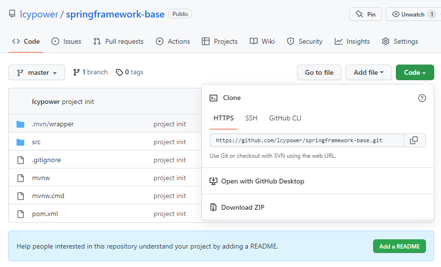
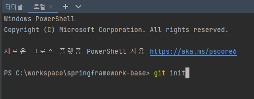

# Git이란?

- 깃(Git)은 형상 관리 도구 중 하나이다.
- 파일의 변경사항을 추적하고 여러 명의 작업자들이 작업을 조율하기 위한 분산버전관리 시스템이다.

# Git의 장점

- 소스코드를 따로 주고 받을 필요가 없다.
- 소스코드의 변경이력이 남는다.
- 같은 소스코드를 여러 사람이 작업하더라도 보다 쉽게 합칠 수 있다.

# Github이란?

- 깃허브(Github)는 분산버전관리시스템(Git)을 사용하여 웹에서 사용할 수 있도록 개발된 웹호스팅서비스이다.
- 깃허브(Github)를 이용하기 위해서는 아래 링크에 가입하여 사용할 수 있으며, 무료로 사용이 가능하며 유료를 사용하여 추가적인 기능을 사용할 수 있다.

[GitHub: Where the world builds software](https://github.com/)

# Git 명령어

## 원격 저장소 주소 알아내기

github에 접속하여 해당 프로젝트에 [code]를 누르면 확인할 수 있다.



## git config

```bash
$git config --global user.name "사용자 이름"
$git config --global user.email "사용자 이메일"
```

- git에 대한 기본적인 설정을 하는 명령어다.
- 유저의 이름과 이메일을 설정하면 깃 레파지토리에 유저의 정보가 소스와 함께 기록되어 관리된다.

## git remote

```bash
$git init
$git remote add origin 원격 저장소 주소
$git pull origin master
$git clone 저장소 주소
```

- 작업할 디렉터리에서 git init 을 이용하여 git을 사용하는 저장소로 초기화한다.
- 초기화를 한 폴더에서 remote를 이용하여 저장소를 연결한다.
- git pull 을 이용하여 origin에 있는 master branch의 소스코드를 가져온다.

## git clone

```bash
$git clone 저장소 주소
```

- git clone 으로 데이터를 가져올 수 있다.
- 해당 명령어를 사용하명 현재 폴더에 깃에 등록된 프로젝트이름으로 폴더가 만들어진다.
- 프로젝트이름 폴더안에 master branch의 소스코드를 가져온다.

## git branch

```bash
$git branch
$git branch dev
$git branch -m master dev
$git branch -d dev
```

- git branch를 이용하면 현재 branch의 목록을 확인할 수 있다.
- git branch [branch명] 을 이용하면 master branch에서 dev라는 이름의 branch를 생성한다.
- -m [기준 branch][생성 branch] 를 이용하여 지정하여 branch를 생성할 수 있다.
- -d [branch] 를 이용하면 branch를 삭제할 수 있다.

## git checkout

```bash
$git checkout dev
```

- git checkout 를 이용하면 현재 사용중인 branch를 변경할 수 있다.

## git merge

```bash
$git checkout master
$git merge dev
```

- git checkout 를 이용하여 현재 사용중인 branch를 master로 변경한다.
- git merge를 이용하여 dev branch의 내용을 현재 사용중인 branch인 master에 병합한다.

## git commit

```bash
$git add sample.java
$git commit -m "커밋메세지"

$git commit -am "커밋메세지"
```

- git commit을 하기 위해서는 add [file]을 이용하여 commit 목록에 파일을 추가해야 한다.
- git commit -m “메세지”를 이용하여 해당 커밋의 코멘트를 할 수 있다.
- 추후에는 add를 하지 않고 -am 옵션을 이용하여 add가 자동으로 되도록 많이 사용한다.

## git push

```bash
$git push 
$git push origin master
$git push -f(-force) origin dev
```

- commit을 하거나 merge를 하였을때 로컬의 저장소를 원격 저장소로 올릴때 push를 사용한다.
- 위와 같이 branch를 생략해도 되며 지정하여도 된다.
- 강제로 push를 진행해야 할 경우는 -f 또는 -force 옵션을 사용하여 push를 진행할 수 있다.

# 인텔리제이 프로젝트에서 Git 안 나타나면?

이미 생성한 프로젝트에 git을 연결하려면 터미널에서 git init 을 실행해주면 된다.



git clone을 이용하여 프로젝트를 미리 가져온 경우에는 위의 작업이 필요하지 않다.

```toc
```